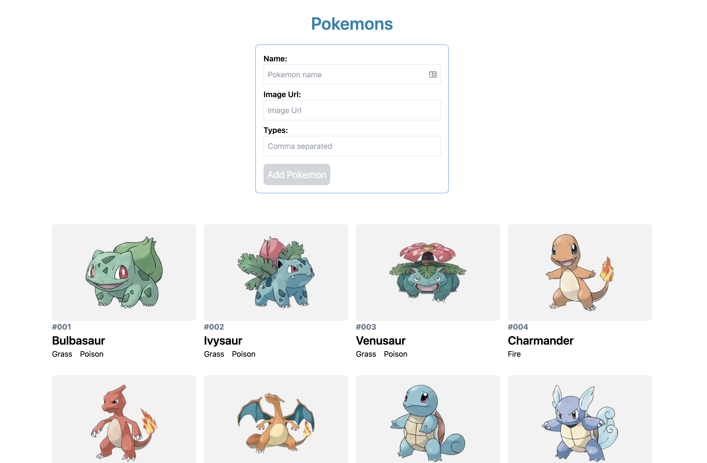
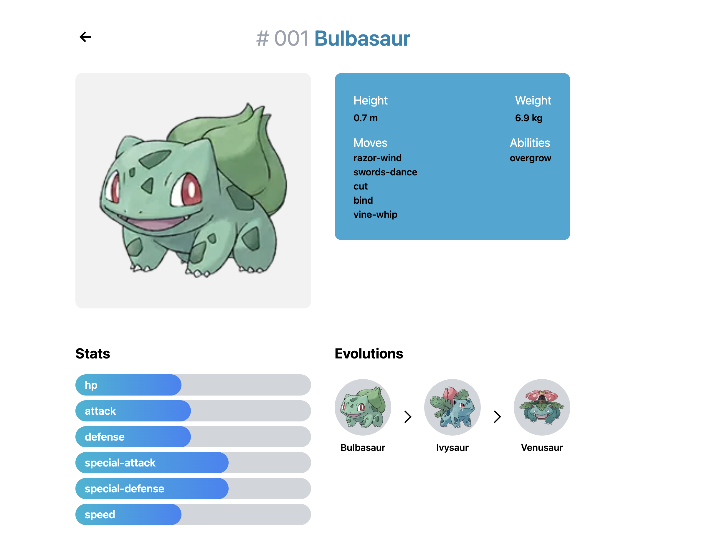

## About

This is a [Pokedex](https://www.pokemon.com/us/pokedex/) clone project using [PokeAPI](https://pokeapi.co/)

## Screenshots

Hope page


Pokemon page


## Tech Stack

- [React.js](https://reactjs.org/)
- [Next.js](https://nextjs.org/)
- [TypeScript](https://www.typescriptlang.org/)
- [TailwindCss](https://tailwindcss.com/)
- [SWR](https://swr.vercel.app/)

## Run the project locally

1. Install deps

   ```bash
    npm install
   ```

2. Run on dev

   ```bash
    npm run dev
   ```

## Demo

[next-pokedex]()
